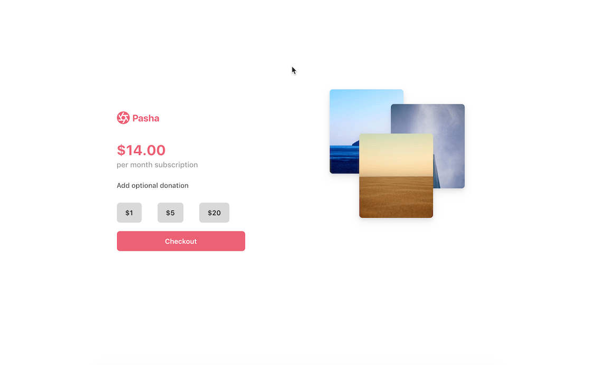

# Starting a subscription with Checkout

There are several ways you can collect card details and use them to start a subscription on Stripe.

This sample uses Checkout, Stripe's prebuilt payment page to collect card details from a customer which then automatically subscribes them to a subscription plan using the [Billing APIs](https://stripe.com/docs/billing).

Checkout offers a subset of Billing functionality. If you require more control over the UI or subscription model you should check out the sample on [setting up subscription with Elements](https://github.com/stripe-samples/set-up-subscriptions). A comparison table of the two integrations:

<!-- prettier-ignore -->
|     | Checkout (this sample) | Elements ([set-up-subscriptions](https://github.com/stripe-samples/set-up-subscriptions))
:--- | :--- | :---
✨ **UI Interface to collect card details**  | Prebuilt hosted payment page with options to customize limited pieces like the business logo and submit button text | Prebuilt, extremely customizable HTML input elements that securely collect card number, CVC, and exp date and are extremely customizable |
📱 **Apple Pay & Google Pay support**  | Built in, no extra code needed  | Requires extra code |
⤵️ **Coupon support for subscriptions**  | Does not support coupons | Supports coupons |


**Demo**

[View](https://508st.sse.codesandbox.io/) a hosted version of the sample or [fork](https://codesandbox.io/s/checkout-subscription-with-add-on-508st) the sample on CodeSandbox.

The hosted demo is running in test mode -- use `4242424242424242` as a test card number with any CVC + future expiration date.

Use the `4000000000003220` test card number to trigger a 3D Secure challenge flow.

Read more about test cards on Stripe at https://stripe.com/docs/testing.

[](https://508st.sse.codesandbox.io/)

## How to run locally

This sample includes 6 server implementations in Node, Ruby, Python, Java, PHP, and Go.

Follow the steps below to run locally.

**1. Clone and configure the sample**

The Stripe CLI is the fastest way to clone and configure a sample to run locally.

**Using the Stripe CLI**

If you haven't already installed the CLI, follow the [installation steps](https://github.com/stripe/stripe-cli#installation) in the project README. The CLI is useful for cloning samples and locally testing webhooks and Stripe integrations.

In your terminal shell, run the Stripe CLI command to clone the sample:

```
stripe samples create checkout-subscription-and-add-on
```

The CLI will walk you through picking your integration type, server and client languages, and configuring your .env config file with your Stripe API keys.

**Installing and cloning manually**

If you do not want to use the Stripe CLI, you can manually clone and configure the sample yourself:

```
git clone https://github.com/stripe-samples/checkout-subscription-and-add-on
```

Copy the .env.example file into a file named .env in the folder of the server you want to use. For example:

```
cp .env.example client-and-server/server/node/.env
```

You will need a Stripe account in order to run the demo. Once you set up your account, go to the Stripe [developer dashboard](https://stripe.com/docs/development#api-keys) to find your API keys.

```
STRIPE_PUBLISHABLE_KEY=<replace-with-your-publishable-key>
STRIPE_SECRET_KEY=<replace-with-your-secret-key>
```

The other environment variables are configurable:

`STATIC_DIR` tells the server where to the client files are located and does not need to be modified unless you move the server files.

`SUBSCRIPTION_PLAN_ID` requires a Plan ID for a subscription.

`DOMAIN` is the domain of your website, where Checkout will redirect back to after the customer completes the payment on the Checkout page.

**2. Create Products and Plans on Stripe**

This sample requires a [Plan](https://stripe.com/docs/api/plans/object) ID to create the Checkout page. Products and Plans are objects on Stripe that lets you model a subscription.

You can create Products and Plans [in the dashboard](https://dashboard.stripe.com/products) or via [the API](https://stripe.com/docs/api/plans/create). Create a Plan before running this sample.


**3. Follow the server instructions on how to run:**

Pick the server language you want and follow the instructions in the server folder README on how to run.

For example, if you want to run the Node server:

```
cd server/node # there's a README in this folder with instructions
npm install
npm start
```

**5. [Optional] Run a webhook locally:**

You can use the Stripe CLI to easily spin up a local webhook.

First [install the CLI](https://stripe.com/docs/stripe-cli) and [link your Stripe account](https://stripe.com/docs/stripe-cli#link-account).

```
stripe listen --forward-to localhost:4242/webhook
```

The CLI will print a webhook secret key to the console. Set `STRIPE_WEBHOOK_SECRET` to this value in your .env file.

You should see events logged in the console where the CLI is running.

When you are ready to create a live webhook endpoint, follow our guide in the docs on [configuring a webhook endpoint in the dashboard](https://stripe.com/docs/webhooks/setup#configure-webhook-settings).


## FAQ
Q: Why did you pick these frameworks?

A: We chose the most minimal framework to convey the key Stripe calls and concepts you need to understand. These demos are meant as an educational tool that helps you roadmap how to integrate Stripe within your own system independent of the framework.

Q: Can you show me how to build X?

A: We are always looking for new recipe ideas, please email dev-samples@stripe.com with your suggestion!

## Author(s)
[@adreyfus-stripe](https://twitter.com/adrind)
